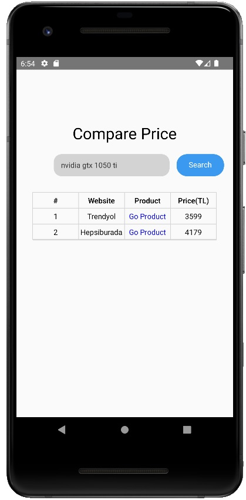
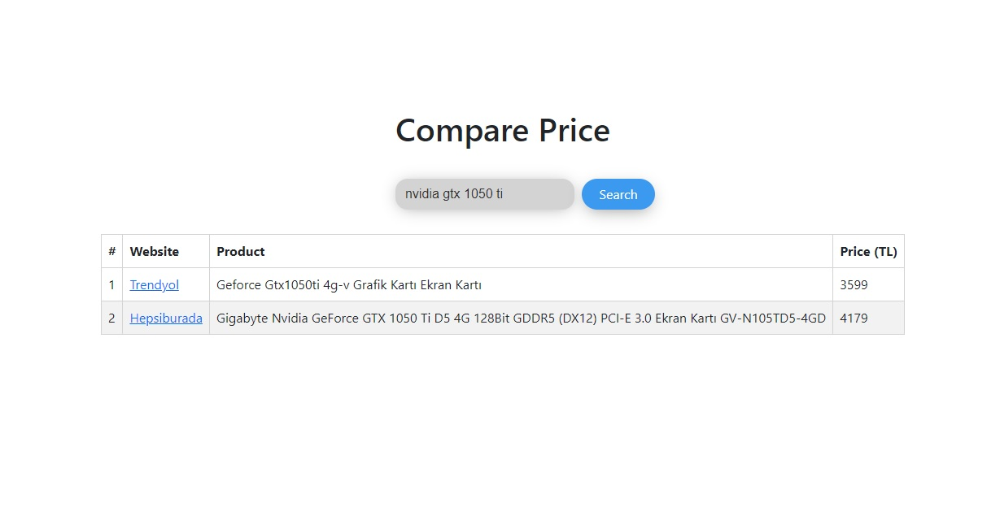

# Price Comparison Mobile App & Website
## About
- A cross platform app using React and React Native with Typescript for the Front-end and Fastapi for the Back-end.
- Compares product prices between Hepsiburada and Trendyol.
## Screenshots
### Mobile

### Web

## Prerequisites
- Android Studio 2021.2+
- Node 18.4+
- Python 3.10+

## Setup

### Frontend - Mobile App
- Follow the official documentation guide: <a href="https://reactnative.dev/docs/environment-setup">Environment setup</a>

### Frontend - Web
- Install dependency requirements
```bash
npm install
```
- Build the web
```bash
npm run build
```
### Backend
- Install backend requirements
```bash
pip install -r requirements.txt
```

## Usage
### Frontend - Mobile App
- Open an emulator.
- Run the react-native run-android in the root of frontend-mobile project as follows:
```bash
npm run start
```
```
npm run android
```
### Frontend - Web
- In the frontend-web directory run it as follows:
```bash
npm run start
```

### Backend
- In the backend directory run it as follows:
```bash
uvicorn main:app --reload
```

## Access Ports
- Frontend-mobile: localhost:8081
- Frontend-web: localhost:3000
- Backend: localhost:8000